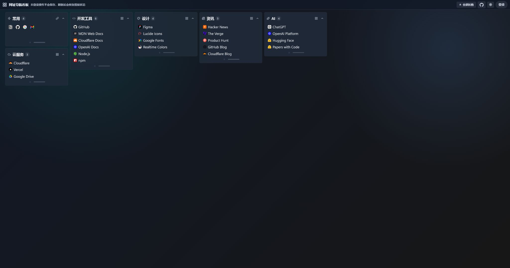

# board-trello

基于 Cloudflare Workers + KV 的网址导航看板。前端使用 vanilla JS，无构建步骤；后端提供数据读写、鉴权、备份、图标代理和云端备份接口。



预览图展示了暗色主题下的看板布局；顶部工具栏可在浅色和暗色主题之间切换。

## 功能

- 公开只读访问：未登录用户可以浏览网址、打开链接、切换显示模式、折叠/展开 board、调整本地视图和拖拽查看，但不会保存；管理员登录后可新增、编辑、删除和拖拽排序并保存到云端。
- 看板数据存储在 Cloudflare KV，浏览器 localStorage 作为只读缓存和迁移兜底。
- 支持列表、图标、纯网址三种显示模式。
- 支持顶部浅色/暗色主题切换，主题偏好会保存在浏览器 localStorage。
- 网站图标通过 Worker 代理获取并缓存；GitHub 链接使用内置 GitHub 图标。
- 每次覆盖数据前自动写入 KV 历史备份，默认保留最近 10 份。
- 支持 Google Drive 和 Dropbox 云端备份；云端默认保留最近 100 份，恢复列表只展示最近 10 份。
- 支持从 KV 历史备份、Google Drive、Dropbox 恢复整份看板数据。
- 本地托管 Lucide 图标字体，无 CDN 依赖。

项目采用 MIT License。第三方资源声明见 [THIRD_PARTY_NOTICES.md](./THIRD_PARTY_NOTICES.md)。

## 本地开发

要求 Node.js 20 或更高版本。

```bash
npm install
copy .dev.vars.example .dev.vars
npm run dev
```

访问 `http://127.0.0.1:8787`。

`.dev.vars` 不会提交到 Git。请将其中的 `ADMIN_PASSWORD` 和 `SESSION_SECRET` 替换为本地开发值。后端会拒绝空密码、`change-me-now`、少于 12 位的 `ADMIN_PASSWORD`，以及少于 32 位的 `SESSION_SECRET`。

## 部署

macOS / Linux：

```bash
chmod +x ./scripts/cloudflare.sh
./scripts/cloudflare.sh
```

Windows PowerShell：

```powershell
.\scripts\cloudflare.ps1
```

也可使用 `npm run deploy`（macOS / Linux）或 `npm run deploy:win`（Windows）。

macOS / Linux 脚本依赖 `bash`、`curl` 和 `jq`。

部署脚本会完成以下事项：

- 检查或保存 Cloudflare deploy token。
- 创建或复用 `BOARD_KV`。
- 生成本地 `.wrangler.deploy.toml`，写入真实 KV namespace id。
- 调用 Wrangler 部署 Worker 和静态资源。
- 按需设置生产环境 `ADMIN_PASSWORD` 和 `SESSION_SECRET`。

`wrangler.toml` 中的 KV id 保留为 `REPLACE_WITH_KV_ID`。真实 namespace id 写入本地 `.wrangler.deploy.toml`，该文件已加入 `.gitignore`。

部署完成后，脚本会输出访问地址。绑定自定义域可在 Cloudflare Dashboard 的 Workers & Pages 设置中完成。

## 环境变量和 Secrets

本地开发使用 `.dev.vars`。生产环境使用 Wrangler secrets：

```bash
npx wrangler secret put ADMIN_PASSWORD
npx wrangler secret put SESSION_SECRET
```

云端备份按需配置：

```bash
npx wrangler secret put GOOGLE_CLIENT_ID
npx wrangler secret put GOOGLE_CLIENT_SECRET

npx wrangler secret put DROPBOX_CLIENT_ID
npx wrangler secret put DROPBOX_CLIENT_SECRET
```

修改 `ADMIN_PASSWORD` 后无需重新部署。修改 `SESSION_SECRET` 会使所有现有登录会话失效。

## 云端备份

应用每次覆盖 `state` 前会先写入一份 KV 历史备份 `state_backup:*`。如果已连接 Google Drive 或 Dropbox，同一份备份会异步上传到对应云端目录。云端上传或清理失败不会阻断正常保存。

云端备份文件名格式：

```text
state_backup_2026-05-11T08-30-00-000Z.json
```

### Google Drive

| 配置项 | 值 |
|---|---|
| 创建入口 | <https://console.cloud.google.com/> |
| 回调地址 | `https://你的域名/api/cloud-backup/google/callback` |
| Secrets | `GOOGLE_CLIENT_ID` / `GOOGLE_CLIENT_SECRET` |
| OAuth scope | `https://www.googleapis.com/auth/drive.file` |

配置步骤：

1. 打开 Google Cloud Console，进入 **APIs & Services** -> **Credentials**。
2. 创建 **OAuth client ID**，Application type 选择 **Web application**。
3. 在 **Authorized JavaScript origins** 添加站点来源，例如 `https://你的域名`。
4. 在 **Authorized redirect URIs** 添加完整回调地址。
5. 保存 Client ID 和 Client Secret，并写入 Cloudflare secrets。
6. 如果 OAuth consent screen 处于 Testing 状态，将授权账号加入 Test users。

### Dropbox

| 配置项 | 值 |
|---|---|
| 创建入口 | <https://www.dropbox.com/developers/apps> |
| 回调地址 | `https://你的域名/api/cloud-backup/dropbox/callback` |
| Secrets | `DROPBOX_CLIENT_ID` / `DROPBOX_CLIENT_SECRET` |
| OAuth scopes | `files.content.read`、`files.content.write`、`files.metadata.read`、`files.metadata.write` |

配置步骤：

1. 打开 Dropbox App Console，点击 **Create app**。
2. API 选择 **Scoped access**。
3. Access type 建议选择 **App folder**。
4. 在 **Permissions** 中勾选以下权限：

```text
files.content.read
files.content.write
files.metadata.read
files.metadata.write
```

5. 在 **Settings** 的 **OAuth 2 Redirect URIs** 中添加完整回调地址。
6. 复制 **App key** 和 **App secret**，分别写入 `DROPBOX_CLIENT_ID` 和 `DROPBOX_CLIENT_SECRET`。

如果已有连接是在权限变更前授权的，需要在看板中断开 Dropbox 后重新连接，否则旧 refresh token 不会获得新增权限。

### 后台操作

1. 管理员登录看板。
2. 打开顶栏云备份菜单。
3. 对已配置的 Google Drive 或 Dropbox 点击连接。
4. 完成 OAuth 授权后返回看板。
5. 连接成功后可查看状态、断开连接、打开云端恢复列表。

断开连接只删除本应用保存在 KV 中的 token 和连接状态，不删除云端已有备份文件。

## API

| 路径 | 方法 | 鉴权 | 说明 |
|---|---|---|---|
| `/api/board` | GET | 否 | 返回 `{version, updatedAt, boards}`；首次访问返回 `null` |
| `/api/board` | PUT | 是 | 版本一致时整体替换看板数据 |
| `/api/backups` | GET | 是 | 列出最近 KV 历史备份 |
| `/api/backups/restore` | POST | 是 | 从 KV 历史备份恢复 |
| `/api/cloud-backup/status` | GET | 是 | 返回云备份配置、连接和最近备份状态 |
| `/api/cloud-backup/:provider/connect` | POST | 是 | 返回 OAuth 授权地址 |
| `/api/cloud-backup/:provider/callback` | GET | 否 | OAuth 回调 |
| `/api/cloud-backup/:provider/disconnect` | POST | 是 | 断开云备份连接 |
| `/api/cloud-backup/:provider/backups` | GET | 是 | 列出云端最近 10 份备份 |
| `/api/cloud-backup/:provider/restore` | POST | 是 | 从云端备份恢复 |
| `/api/favicon` | GET | 否 | 获取并缓存网站 favicon |
| `/api/url-titles` | POST | 否 | 获取 URL 标题 |
| `/api/login` | POST | 否 | 管理员登录 |
| `/api/logout` | POST | 是 | 登出 |
| `/api/auth` | GET | 否 | 返回登录状态和 CSRF token |

写接口要求同源请求，并在管理员登录后携带 CSRF token。

## 安全建议

- `ADMIN_PASSWORD` 使用至少 16 位随机字符串。
- `SESSION_SECRET` 使用至少 32 字节随机值，例如 `openssl rand -hex 32`。
- 生产环境使用 HTTPS。
- 自定义域建议开启 Cloudflare Bot Fight Mode、`/api/login` 边缘速率限制、Always Use HTTPS 和 HSTS。
- 不要提交 `.dev.vars`、`.wrangler.deploy.toml`、`.cloudflare-token.local` 等本地密钥文件。

## 验证清单

- [ ] `GET /api/auth` 未登录时返回 `{"isAdmin":false}`。
- [ ] 错误密码连续登录达到限制后返回 `429`。
- [ ] 弱 `ADMIN_PASSWORD` 或 `SESSION_SECRET` 配置会返回 `500`。
- [ ] 未登录访问可以浏览网址、打开链接、切换显示模式、折叠/展开 board 和调整本地视图，但刷新后恢复云端状态。
- [ ] 顶部主题按钮可以在浅色/暗色主题之间切换，并在刷新后保留主题偏好。
- [ ] 管理员登录后可以新增、编辑、删除、拖拽排序、保存和恢复备份。
- [ ] 保存数据后生成 KV 历史备份。
- [ ] 已连接云端备份时，保存后生成对应云端备份。
- [ ] Google Drive 和 Dropbox 的 OAuth 回调地址与控制台配置完全一致。

## 架构

```text
Browser
  ├─ src/                         vanilla JS frontend
  └─ fetch
       └─ Cloudflare Worker
            ├─ boardRoutes        board state and KV backups
            ├─ cloudBackup        Google Drive / Dropbox backup and restore
            ├─ authRoutes         login, logout, auth status
            ├─ miscRoutes         favicon and URL title proxy
            └─ Cloudflare KV      state, sessions, backup metadata
```

数据模型以整份 boards 数组为单位保存，并带有版本号。写入时会校验版本，避免覆盖并发更新。保存冲突时，本地数据会保留在浏览器缓存中。

## 项目结构

```text
.
├── src/                  前端静态资源
│   ├── index.html
│   ├── script.js
│   ├── style.css
│   └── fonts/
├── worker/src/           Worker 源码
│   ├── auth.ts
│   ├── authRoutes.ts
│   ├── boardRoutes.ts
│   ├── cloudBackup.ts
│   ├── config.ts
│   ├── index.ts
│   ├── miscRoutes.ts
│   ├── shared.ts
│   ├── urlSafety.ts
│   └── validation.ts
├── worker/test/          Node 测试
├── scripts/              部署脚本
├── wrangler.toml
├── package.json
└── tsconfig.json
```

## 常用命令

| 命令 | 说明 |
|---|---|
| `npm run dev` | 启动本地开发服务 |
| `npm run typecheck` | TypeScript 类型检查 |
| `npm test` | 编译 Worker 并运行测试 |
| `npm run deploy` | 运行 Cloudflare 部署脚本（macOS / Linux） |
| `npm run deploy:win` | 运行 Cloudflare 部署脚本（Windows） |

## 故障排查

### `/api/board` 返回 500

检查 KV namespace id、`ADMIN_PASSWORD`、`SESSION_SECRET` 是否正确配置。

### 登录后仍为只读

检查浏览器是否拦截 cookie。生产环境 cookie 带 `Secure` 标志，只在 HTTPS 下生效。

### Google Drive 授权返回 `403: access_denied`

如果 OAuth app 处于 Testing 状态，需要将当前 Google 账号加入 Test users。

### Dropbox 恢复提示缺少 `files.content.read`

在 Dropbox App Console 的 **Permissions** 中启用 `files.content.read`，保存后在看板中断开并重新连接 Dropbox。

### Dropbox 提示 `Invalid redirect_uri`

在 Dropbox App Console 的 **Settings** 中添加完整回调地址：

```text
https://你的域名/api/cloud-backup/dropbox/callback
```

地址必须与请求中的 `redirect_uri` 完全一致，包括路径，末尾不要多加 `/`。

### 清空本地 KV 数据

```bash
npx wrangler kv key delete --binding BOARD_KV state --local
```

### 清空生产 KV 数据

```bash
npx wrangler kv key delete --binding BOARD_KV state --remote
```
