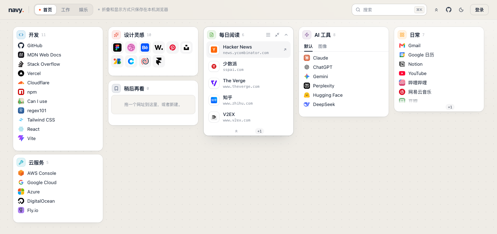
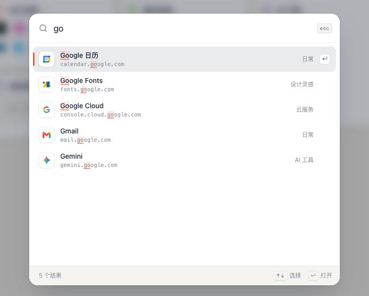
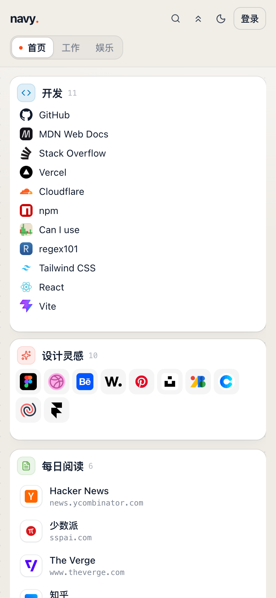
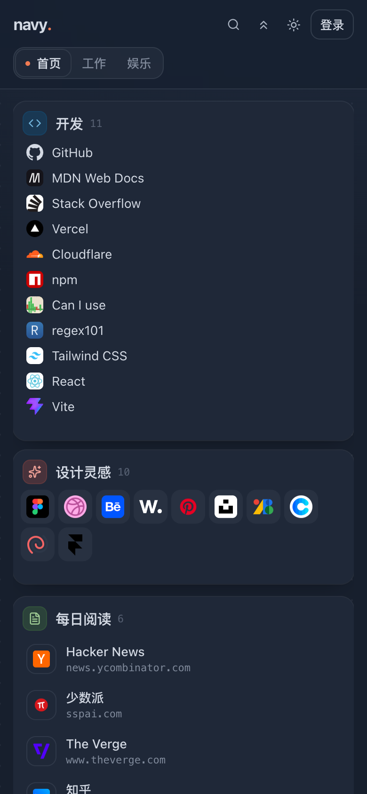

<div align="center">


# navy.

**一个安静、快速、完全自托管的网址导航看板**

跑在 Cloudflare Workers 上 · 无需服务器 · 免费额度即可长期使用

[](https://github.com/bolabola/navy/actions/workflows/ci.yml)
[](./LICENSE)


[功能](#-功能) · [快速开始](#-快速开始) · [部署](#-部署到-cloudflare) · [备份](#-备份与恢复) · [API](#-api) · [故障排查](#-故障排查)

<br>

<picture>
  <source media="(prefers-color-scheme: dark)" srcset="./docs/screenshot-dark.png">
  
</picture>

<sub>界面会跟随系统切换浅色 / 暗色，上图也会随你当前 GitHub 的主题显示对应版本。</sub>

</div>

<br>

## ✨ 功能

<table>
<tr>
<td width="50%" valign="top">

**⌘K 全局搜索**<br>
跨页面、跨看板查找所有链接，标题、网址、描述都能搜。方向键选择，回车直接打开。

</td>
<td width="50%" valign="top">

**多页面 · 多看板 · 分组**<br>
用页面区分场景，用看板归类链接，看板内还能再分组。瀑布流布局，拖拽排序、拖拽调整高度。

</td>
</tr>
<tr>
<td valign="top">

**三种显示模式**<br>
列表、图标网格、带网址的详情模式。图标大小三档可调，每个看板单独设置。

</td>
<td valign="top">

**浅色 / 暗色主题**<br>
默认跟随系统，也可以手动切换并记住选择，打开页面时不会闪烁。

</td>
</tr>
<tr>
<td valign="top">

**访客只读 · 管理员编辑**<br>
任何人都能浏览和打开链接，折叠、显示方式只存在访客自己的浏览器里。管理员登录后才能修改并保存。

</td>
<td valign="top">

**数据安全**<br>
Durable Object 强一致存储，并发保存不会互相覆盖。自动历史备份，还能定时备份到 Google Drive / Dropbox。

</td>
</tr>
<tr>
<td valign="top">

**快**<br>
无框架、无 CDN。图标字体只加载用到的约 20 KB 子集，匿名访客从边缘 KV 读取数据。

</td>
<td valign="top">

**导入导出**<br>
导入浏览器书签 HTML，导出 / 导入完整 JSON；单个看板可以批量导入网址或导出 CSV。

</td>
</tr>
</table>

<div align="center">
<table>
<tr>
<td align="center"><br><sub>⌘K 搜索面板</sub></td>
<td align="center"><br><sub>手机 · 浅色</sub></td>
<td align="center"><br><sub>手机 · 暗色</sub></td>
</tr>
</table>
</div>

### 键盘快捷键

| 按键 | 作用 |
|---|---|
| <kbd>⌘</kbd> <kbd>K</kbd> / <kbd>Ctrl</kbd> <kbd>K</kbd> | 打开或关闭搜索 |
| <kbd>/</kbd> | 打开搜索（焦点不在输入框时） |
| <kbd>↑</kbd> <kbd>↓</kbd> | 在搜索结果中选择 |
| <kbd>Enter</kbd> | 在新标签页打开选中的链接 |
| <kbd>Esc</kbd> | 关闭搜索或图标选择器 |

<br>

## 🚀 快速开始

需要 **Node.js 20+**。

```bash
git clone git@github.com:bolabola/navy.git
cd navy
npm install
cp .dev.vars.example .dev.vars      # Windows: copy .dev.vars.example .dev.vars
npm run dev
```

打开 <http://127.0.0.1:8787>。`wrangler dev` 会自动构建前端（`scripts/build.mjs`），修改 `frontend/` 后自动重新构建。

> [!IMPORTANT]
> 先把 `.dev.vars` 里的 `ADMIN_PASSWORD` 和 `SESSION_SECRET` 改成你自己的本地值。后端会拒绝空密码、`change-me-now`、少于 12 位的 `ADMIN_PASSWORD`，以及少于 32 位的 `SESSION_SECRET`。`.dev.vars` 不会被提交到 Git。

<br>

## 🚢 部署到 Cloudflare

一条命令完成部署：

```bash
npm run deploy          # macOS / Linux，依赖 bash、curl、jq
npm run deploy:win      # Windows PowerShell
```

部署脚本会依次：

1. 检查或保存 Cloudflare 部署 token
2. 创建或复用 KV 命名空间 `BOARD_KV`
3. 生成本地 `.wrangler.deploy.toml`，写入真实的 KV namespace id
4. 按需设置生产环境的 `ADMIN_PASSWORD` 和 `SESSION_SECRET`
5. 用 Wrangler 部署 Worker 和静态资源，并输出访问地址

<details>
<summary><b>如何创建部署 token</b></summary>

<br>

推荐让脚本自动创建一个权限最小的部署 token：

1. 打开 Cloudflare **My Profile → [API Tokens](https://dash.cloudflare.com/profile/api-tokens)**，点 **Create Token**。
2. 选择 **Create Additional Tokens** 模板，过期时间建议设得很短。
3. 复制生成的 token，然后运行：

   ```bash
   bash scripts/cloudflare.sh --create-deploy-token --save-token-to-user-environment
   ```

4. 粘贴刚才的 token。脚本会创建一个只有 Workers Scripts 编辑、Workers KV 编辑、账户设置只读权限的部署 token，保存到 `~/.config/board-trello/cloudflare.env`。
5. 之后直接 `npm run deploy` 即可。用完的引导 token 建议删除。

</details>

<details>
<summary><b>部署脚本的全部选项</b></summary>

<br>

```text
--wizard                         交互式向导（不带参数时的默认行为）
--create-deploy-token            用引导 token 创建权限最小的部署 token
--set-token                      粘贴并保存已有的部署 token
--prepare-kv                     创建或复用 BOARD_KV，并写入 .wrangler.deploy.toml
--set-secrets                    设置生产环境 ADMIN_PASSWORD 和 SESSION_SECRET
--deploy                         用 Wrangler 部署
--all                            依次执行 prepare-kv、set-secrets、deploy
--account-id <id>                指定 Cloudflare 账号
--worker-name <name>             Worker 名称（默认 board-trello）
--save-token-to-user-environment 把 token 保存到 ~/.config/board-trello/cloudflare.env
--save-token-to-local-file       把 token 保存到 .cloudflare-token.local
```

</details>

`wrangler.toml` 中的 KV id 保留为占位符 `REPLACE_WITH_KV_ID`，真实 id 只写入已被忽略的 `.wrangler.deploy.toml`。绑定自定义域名可以在 Cloudflare Dashboard 的 **Workers & Pages** 设置中完成。

### 环境变量与 Secrets

| 名称 | 必需 | 说明 |
|---|:---:|---|
| `ADMIN_PASSWORD` | ✅ | 管理员密码，建议 16 位以上随机字符串。修改后无需重新部署 |
| `SESSION_SECRET` | ✅ | 会话签名密钥，至少 32 字节，例如 `openssl rand -hex 32`。修改会让所有登录失效 |
| `GOOGLE_CLIENT_ID` / `GOOGLE_CLIENT_SECRET` |  | 开启 Google Drive 云备份 |
| `DROPBOX_CLIENT_ID` / `DROPBOX_CLIENT_SECRET` |  | 开启 Dropbox 云备份 |

本地开发写在 `.dev.vars`，生产环境用 Wrangler secrets：

```bash
npx wrangler secret put ADMIN_PASSWORD
npx wrangler secret put SESSION_SECRET
```

<br>

## 🛟 备份与恢复

| | 何时触发 | 存在哪里 | 保留 |
|---|---|---|---|
| **历史备份** | 保存时距上次备份超过 10 分钟才备份；恢复备份前总会先备份 | Durable Object | 最近 20 份 |
| **云端备份** | Cron 每小时检查一次，内容有变化才上传；也可以在备份菜单中“立即备份” | Google Drive / Dropbox | 最近 100 份（恢复列表显示最近 10 份） |

两种备份都可以在顶栏的备份菜单里一键恢复整份看板。云端上传失败不会影响正常保存，下次定时任务会重试。云端备份文件名形如 `state_backup_2026-05-11T08-30-00-000Z.json`。

<details>
<summary><b>配置 Google Drive</b></summary>

<br>

| 配置项 | 值 |
|---|---|
| 创建入口 | <https://console.cloud.google.com/> |
| 回调地址 | `https://你的域名/api/cloud-backup/google/callback` |
| Secrets | `GOOGLE_CLIENT_ID` / `GOOGLE_CLIENT_SECRET` |
| OAuth scope | `https://www.googleapis.com/auth/drive.file` |

1. 打开 Google Cloud Console，进入 **APIs & Services → Credentials**。
2. 创建 **OAuth client ID**，Application type 选择 **Web application**。
3. 在 **Authorized JavaScript origins** 添加站点来源，例如 `https://你的域名`。
4. 在 **Authorized redirect URIs** 添加完整回调地址。
5. 把 Client ID 和 Client Secret 写入 Cloudflare secrets。
6. 如果 OAuth consent screen 处于 Testing 状态，把授权账号加入 **Test users**。

</details>

<details>
<summary><b>配置 Dropbox</b></summary>

<br>

| 配置项 | 值 |
|---|---|
| 创建入口 | <https://www.dropbox.com/developers/apps> |
| 回调地址 | `https://你的域名/api/cloud-backup/dropbox/callback` |
| Secrets | `DROPBOX_CLIENT_ID` / `DROPBOX_CLIENT_SECRET` |
| OAuth scopes | `files.content.read` `files.content.write` `files.metadata.read` `files.metadata.write` |

1. 打开 Dropbox App Console，点击 **Create app**。
2. API 选择 **Scoped access**，Access type 建议选 **App folder**。
3. 在 **Permissions** 中勾选上面四个权限。
4. 在 **Settings → OAuth 2 Redirect URIs** 中添加完整回调地址。
5. 把 **App key** 和 **App secret** 分别写入 `DROPBOX_CLIENT_ID` 和 `DROPBOX_CLIENT_SECRET`。

如果连接是在权限变更前授权的，需要在看板中断开 Dropbox 后重新连接，旧的 refresh token 不会获得新增权限。

</details>

<details>
<summary><b>在看板中连接云盘</b></summary>

<br>

1. 管理员登录看板，打开顶栏的备份菜单。
2. 对已配置的 Google Drive 或 Dropbox 点击 **连接**。完成 OAuth 授权后会回到看板，并立即做第一份备份。
3. 之后可以在同一个菜单里查看状态、立即备份、断开连接、打开云端恢复列表。

断开连接只删除本应用保存的 token 和连接状态，不会删除云端已有的备份文件。

</details>

<br>

## 🏗 架构

```text
浏览器
  ├─ dist/                      前端构建产物（Workers Static Assets，frontend/_headers 提供安全头）
  └─ fetch /api/*
       └─ Cloudflare Worker  ·  worker/src/index.ts
            ├─ boardRoutes      看板读写、历史备份
            │    └─ BoardStateObject (Durable Object)   权威存储，强一致
            │         └─ 每次提交镜像到 KV，供匿名访客在边缘快速读取
            ├─ cloudBackup      Google Drive / Dropbox；scheduled() 定时备份
            ├─ authRoutes       登录、登出、登录状态
            ├─ miscRoutes       favicon 与网址标题代理
            └─ Cloudflare KV    会话、登录限流、云备份配置、看板镜像
```

数据以整份页面数据为单位保存，带版本号。版本检查和写入在同一个 Durable Object 内串行执行，所以并发保存只会有一个成功，另一个返回 `409`，本地改动会保留在浏览器缓存里。旧版存放在 KV 中的数据会在首次访问时自动迁移。

**技术栈**：原生 JavaScript（ES 模块，esbuild 打包）· 手写 CSS 设计系统（设计 token + 明暗主题）· TypeScript Worker · Durable Objects · KV · Vitest（运行在 workerd 中）· 本地托管的 [Lucide](https://lucide.dev) 图标字体。

<details>
<summary><b>项目结构</b></summary>

<br>

```text
.
├── frontend/              前端源码（构建后输出到 dist/）
│   ├── index.html
│   ├── main.js            入口：初始化状态、注册事件、启动
│   ├── theme-init.js      首帧前确定主题，避免闪烁
│   ├── js/                按职责拆分的模块（render、layout、search、sync、backup、events/ …）
│   ├── style.css          设计系统与全部组件样式
│   ├── styles.css         样式入口（图标字体 + style.css）
│   ├── _headers           静态资源响应头（安全头、长期缓存）
│   └── fonts/
├── shared/limits.ts       前后端共享的数据限制
├── worker/src/            Worker 源码
│   ├── index.ts           路由表、scheduled 入口
│   ├── boardRepo.ts       Durable Object 与看板仓储
│   ├── boardStore.ts      状态读写、历史备份节流与清理
│   ├── cloudBackup.ts     云备份业务（定时任务、状态、恢复）
│   ├── cloudProviders.ts  Google Drive / Dropbox API
│   ├── auth.ts · authRoutes.ts · boardRoutes.ts · miscRoutes.ts
│   ├── validation.ts      校验与白名单清洗
│   └── shared.ts · urlSafety.ts · config.ts
├── worker/test/           Vitest 测试（运行在 workerd 中）
├── scripts/               构建与部署脚本
└── wrangler.toml
```

</details>

### 常用命令

| 命令 | 说明 |
|---|---|
| `npm run dev` | 启动本地开发服务，自动构建前端 |
| `npm run build` | 构建前端到 `dist/` |
| `npm run typecheck` | TypeScript 类型检查 |
| `npm test` | 构建前端并在 workerd 中运行测试 |
| `npm run deploy` | 部署到 Cloudflare（macOS / Linux） |
| `npm run deploy:win` | 部署到 Cloudflare（Windows） |

<br>

## 📡 API

所有写接口都要求同源请求，并在管理员登录后携带 CSRF token（从 `GET /api/auth` 获取）。

<details>
<summary><b>接口列表</b></summary>

<br>

| 路径 | 方法 | 鉴权 | 说明 |
|---|---|:---:|---|
| `/api/board` | GET |  | 返回 `{version, updatedAt, pages, activePageId, layout, boards}`（`boards` 为当前页）；首次访问返回 `null` |
| `/api/board` | PUT | 🔒 | 版本一致时整体替换看板数据；只需发送 `pages`，返回 `lastBackupAt` |
| `/api/backups` | GET | 🔒 | 列出最近的历史备份 |
| `/api/backups/restore` | POST | 🔒 | 从历史备份恢复 |
| `/api/cloud-backup/status` | GET | 🔒 | 云备份配置、连接和最近备份状态 |
| `/api/cloud-backup/:provider/connect` | POST | 🔒 | 返回 OAuth 授权地址 |
| `/api/cloud-backup/:provider/callback` | GET |  | OAuth 回调 |
| `/api/cloud-backup/:provider/run` | POST | 🔒 | 立即备份到该云盘 |
| `/api/cloud-backup/:provider/disconnect` | POST | 🔒 | 断开云备份连接 |
| `/api/cloud-backup/:provider/backups` | GET | 🔒 | 列出云端最近 10 份备份 |
| `/api/cloud-backup/:provider/restore` | POST | 🔒 | 从云端备份恢复 |
| `/api/favicon` | GET |  | 获取并缓存网站图标（`refresh=1` 仅管理员生效；找不到时返回 1×1 占位图） |
| `/api/url-titles` | POST | 🔒 | 获取网址标题和描述 |
| `/api/login` | POST |  | 管理员登录 |
| `/api/logout` | POST | 🔒 | 登出 |
| `/api/auth` | GET |  | 登录状态和 CSRF token |

</details>

<br>

## 🔐 安全建议

- `ADMIN_PASSWORD` 使用至少 16 位随机字符串，`SESSION_SECRET` 使用至少 32 字节随机值。
- 生产环境只走 HTTPS。自定义域名建议开启 Bot Fight Mode、`/api/login` 边缘速率限制、Always Use HTTPS 和 HSTS。
- 不要提交 `.dev.vars`、`.wrangler.deploy.toml`、`.cloudflare-token.local` 等本地密钥文件（均已在 `.gitignore` 中）。
- 前端带严格的 CSP：只允许同源脚本，网站图标也经由自己的 Worker 代理，不直接请求第三方。

<br>

## 🧰 故障排查

<details>
<summary><b><code>/api/board</code> 返回 500</b></summary>

<br>

检查 KV namespace id、`ADMIN_PASSWORD`、`SESSION_SECRET` 是否配置正确，以及 Durable Object 迁移（`wrangler.toml` 中的 `[[migrations]]`）是否已随部署生效。

</details>

<details>
<summary><b>登录后仍然是只读</b></summary>

<br>

检查浏览器是否拦截了 cookie。生产环境的 cookie 带 `Secure` 标志，只在 HTTPS 下生效。

</details>

<details>
<summary><b>Google Drive 授权返回 <code>403: access_denied</code></b></summary>

<br>

OAuth app 处于 Testing 状态时，需要把当前 Google 账号加入 **Test users**。

</details>

<details>
<summary><b>Dropbox 恢复提示缺少 <code>files.content.read</code></b></summary>

<br>

在 Dropbox App Console 的 **Permissions** 中启用 `files.content.read`，保存后在看板中断开并重新连接 Dropbox。

</details>

<details>
<summary><b>Dropbox 提示 <code>Invalid redirect_uri</code></b></summary>

<br>

在 Dropbox App Console 的 **Settings** 中添加完整回调地址。它必须与请求中的 `redirect_uri` 完全一致，包括路径，末尾不要多 `/`：

```text
https://你的域名/api/cloud-backup/dropbox/callback
```

</details>

<details>
<summary><b>清空看板数据</b></summary>

<br>

```bash
npx wrangler kv key delete --binding BOARD_KV state --local    # 本地
npx wrangler kv key delete --binding BOARD_KV state --remote   # 生产
```

</details>

<details>
<summary><b>上线前的验证清单</b></summary>

<br>

- [ ] `GET /api/auth` 未登录时返回 `{"isAdmin":false}`
- [ ] 错误密码连续登录达到限制后返回 `429`
- [ ] 弱 `ADMIN_PASSWORD` 或 `SESSION_SECRET` 配置会返回 `500`
- [ ] 未登录时可以浏览、打开链接、切换显示模式、折叠看板，刷新后恢复云端状态
- [ ] 主题按钮可以切换浅色 / 暗色，刷新后保留选择
- [ ] ⌘K 能搜到其他页面的链接，回车在新标签页打开
- [ ] 管理员可以新增、编辑、删除、拖拽排序、保存和恢复备份
- [ ] 10 分钟内的连续保存只生成一份历史备份
- [ ] 已连接云盘时，“立即备份”或定时任务能生成云端备份
- [ ] Google Drive 和 Dropbox 的回调地址与控制台配置完全一致

</details>

<br>

---

<div align="center">
<sub>
<a href="./LICENSE">MIT License</a> © 2026 bolabola · 图标来自 <a href="https://lucide.dev">Lucide</a> · 第三方声明见 <a href="./THIRD_PARTY_NOTICES.md">THIRD_PARTY_NOTICES.md</a>
</sub>
</div>
